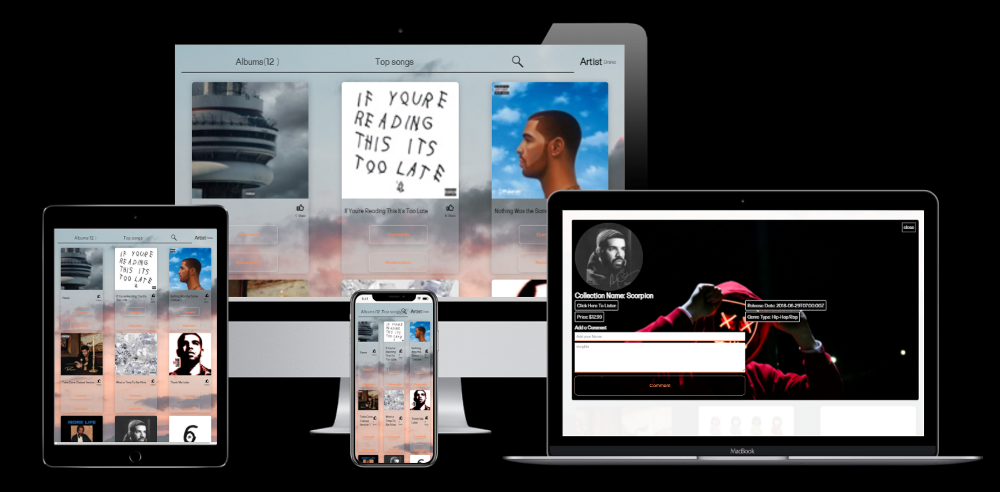

# API-based-webAPP  

> The JavaScript capstone project is about building a personalized web application with the help of an external API. we are using two different APIs to have a complete working web app. We are using one API to retrieve all data for the artist's track, albums, and title, and another API to store all user interactions.

## App screenshot 



## Built With 

- [iTunes Search API](https://developer.apple.com/library/archive/documentation/AudioVideo/Conceptual/iTuneSearchAPI/SearchExamples.html#//apple_ref/doc/uid/TP40017632-CH6-SW1)

- [Involvement API](https://www.notion.so/Involvement-API-869e60b5ad104603aa6db59e08150270)

- [Webpack](https://webpack.js.org)         
            
- [Javascript](https://www.javascript.com)
            
- [Jest](https://jestjs.io)        
            
- [HTML & CSS](https://www.w3.org)
            
  
## Live Demo 


[Live Demo Link](https://wandergithub.github.io/Portfolio/)


## Usage  

Be sure to have [Node.js](https://nodejs.org/) installed before proceeding.

```shell
# Clone the repo
git clone https://github.com/idungstanley/API-based-webAPP.git
# Change directory
cd API-based-webAPP
# Install dependencies
npm i
# Start local server
npm run start
```

## Authors  

👤 **Author1**


- GitHub: [@wandergithub](https://github.com/wandergithub)
- Twitter: [@wanderklk1](https://twitter.com/wanderklk1)
- LinkedIn: [Wander A. Gonzalez](https://www.linkedin.com/in/wander-a-gonzalez-53127b205/)

👤 **Author2**


- GitHub: [@idungstanley](https://github.com/idungstanley)
- Twitter: [@IdungStanley](https://twitter.com/IdungStanley)
- LinkedIn: [Stanley Idung Sunday](https://www.linkedin.com/in/sundaystanley56/)


## Contributing  

Contributions, issues, and feature requests are welcome!

Feel free to check the [issues page](../../issues/).

## Show your support  

Give a ⭐️ if you like this project!

## Acknowledgments

<a target="_blank" href="https://icons8.com/icon/44029/música" style="width: 50px; height: 50px">Música</a> icon by <a target="_blank" href="https://icons8.com">Icons8</a>


## License 

This project is [MIT](./LICENSE) licensed.
